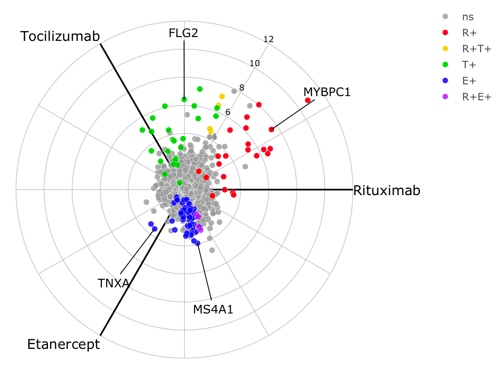
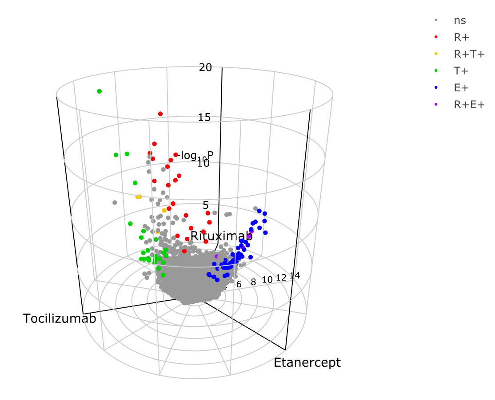
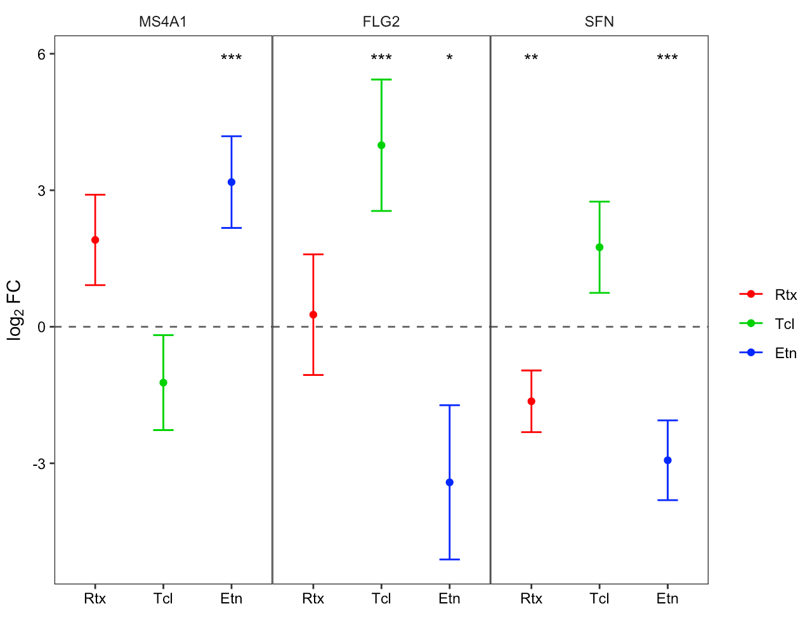

  
<style>
  .title{
    display: none;
  }
</style>  
  
```{r setup, include = FALSE, echo = FALSE}
knitr::opts_chunk$set(echo = TRUE, 
warning = FALSE, 
message = FALSE, 
fig.height = 7, 
fig.width=7, 
fig.align = "center")
library(knitr)
library(kableExtra)
```

## 2x3-way analysis


```{r, echo=FALSE}
library(ggplot2)
library(ggpubr)
library(plotly)
library(usethis)
```

The main work flow for using volcano3D is ideal for comparing high dimensional
data such as gene expression or other biological data across 3 classes, and this
is covered in the main vignette. However, an alternative use of 3-way radial
plots and 3d volcano plots is for 2x3-way analysis. In this type of analysis
there is a binary factor such as drug response (responders vs non-responders)
and a 2nd factor with 3 classes such as a trial with 3 drugs.

## Example

This vignette shows analysis from the STRAP trial in rheumatoid arthritis, in
which patients were randomised to one of three drugs (etanercept, rituximab,
tocilizumab). Clinical response to treatment (a binary outcome) was measured
after 16 weeks. Gene expression data from RNA-Sequencing (RNA-Seq) of synovial biopsies from the patients' inflamed joints was performed at baseline. RNA-Seq data is count based and overdispersed, and thus is typically best modelled by a negative binomial distribution.

## DESeq2 pipeline

Differential gene expression to compare the synovial gene expression between
responders vs non-responders is performed using the Bioconductor package DESeq2.
Since there are 3 distinct drugs this becomes a 2x3-factor analysis.

The following code shows set up and 2x3-way analysis in DESeq2 followed by
generation of a 'volc3d' class results object for plotting and visualisation of
the results.

```{r, eval=FALSE}
library(volcano3D)

# Basic DESeq2 set up
library(DESeq2)

counts <- matrix(rnbinom(n=3000, mu=100, size=1/0.5), ncol=30)
rownames(counts) <- paste0("gene", 1:100)
cond <- rep(factor(rep(1:3, each=5), labels = c('A', 'B', 'C')), 2)
resp <- factor(rep(1:2, each=15), labels = c('non.responder', 'responder'))
metadata <- data.frame(drug = cond, response = resp)

# Full dataset object construction
dds <- DESeqDataSetFromMatrix(counts, metadata, ~response)

# Perform 3x DESeq2 analyses comparing binary response for each drug
res <- deseq_2x3(dds, ~response, "drug")
```

The design formula can contain covariates, however the main contrast should be
the last term of the formula as is standard in DESeq2 analysis.

The function `deseq_2x3()` returns a list of 3 DESeq2 objects containing the
response analysis for each of the three drugs. This object is passed to
`deseq_2x3_polar()` to generate a `volc3d` class object for plotting.

```{r, eval=FALSE}
# Generate polar object
obj <- deseq_2x3_polar(res)

# 2d plot
radial_plotly(obj)

# 3d plot
volcano3D(obj)
```

The example below using real data from the STRAP trial demonstrates a 3-way
radial plot highlighting the relationship between genes significantly increased
in responders across each of the three drugs. The pipe to `toWebGL()` is used to
speed up plotting by using webGL instead of SVG in plotly scatter plots.
Alternatively, a ggplot2 version can be plotted using `radial_ggplot()`.

```{r, eval=FALSE}
obj <- deseq_2x3_polar(data1)
labs <- c('MS4A1', 'TNXA', 'FLG2', 'MYBPC1')
radial_plotly(obj, type=2, label_rows = labs) %>% toWebGL()
```

```{r radial_2x3_pos, echo = FALSE, message=FALSE, fig.align='center', out.width='70%', out.extra='style="border: 0;"'}

```

A 3d volcano plot can be generated too.

```{r volc_2x3, echo = FALSE, message=FALSE, fig.align='center', out.width='70%', out.extra='style="border: 0;"'}

```

To show genes which are significantly increased in non-responders for each drug,
we reprocess the object using the argument `process = "negative"` as this leads
to a different colour scheme for each gene. The polar coordinates are
essentially flipped as each axis represents increased expression in
non-responders.

```{r, eval=FALSE}
obj <- deseq_2x3_polar(data1, process = "negative")
labs <- c('MS4A1', 'TNXA', 'FLG2', 'MYBPC1')
radial_plotly(obj, type=2, label_rows = labs) %>% toWebGL()
```

```{r radial_2x3_neg, echo = FALSE, message=FALSE, fig.align='center', out.width='70%', out.extra='style="border: 0;"'}
knitr::include_graphics("radial_2x3_neg.png")
```

## Custom 2x3-way analysis

The above workflow is designed for RNA-Seq count data. For other raw data types,
the function `polar_coords_2x3()` is used to map attributes to polar coordinates
in a 2x3-way analysis.

```{r eval=FALSE}
polar_obj <- polar_coords_2x3(vstdata, metadata, "ACR.response.status",
                              "Randomised.Medication")

radial_plotly(polar_obj, type=2)
volcano3D(polar_obj)
```

In the above code example `vstdata` contains transformed (approximately
Gaussian) gene expression data with genes in columns and samples in rows.
`metadata` is a dataframe of sample information with samples in rows.
`"ACR.response.status"` refers the the binary response column in `metadata`.
`"Randomised.Medication"` refers to the 3-way group column in `metadata`.

`polar_coords_2x3()` accepts raw data and performs all the calculations needed
to generate coordinates, colours etc for plotting radial 3-way plots or 3d
volcano plots. This differs from the original `polar_coords()` function in that it
is the mean difference between the 2-way response outcome which is used to map
coordinates along each axis for each of the 3 groups for unscaled polar
coordinates.

Scaled polar coordinates are generated using the *t*-statistic for each group
comparison.

There is no straightforward equivalent of a one-way ANOVA or likelihood ratio
test to use for the *z* axis as is used in the simpler 3-way analysis for standard
3-way radial plots/ 3d volcano plots. So instead the *z* axis in a 2x3-way
analysis uses the smallest p-value from each of the 3 paired comparisons. This
p-value is transformed as usual as -log~10~(p).

A table of p-values can be supplied by the user. But if a table of p-values is
absent, p-values are automatically calculated by `polar_coords_2x3()`. Each of
the 3 groups is subsetted and pairwise comparisons of the binary response factor
are performed. Options here include unpaired *t*-test and Wilcoxon test (see
`calc_stats_2x3()`).

The colour scheme is not as straightforward as for the standard polar plot and
volcano3D plot since genes (or attributes) can be significantly up or
downregulated in the response comparison for each of the 3 groups.
`process = "positive"` means that genes are labelled with colours if a gene is
significantly upregulated in the response for that group. This uses the primary
colours (RGB) so that if a gene is upregulated in both red and blue group it
becomes purple etc with secondary colours. If the gene is upregulated in all 3
groups it is labelled black. Non-significant genes are in grey.

With `process = "negative"` genes are coloured when they are significantly
downregulated. With `process = "two.sided"` the colour scheme means that both
significantly up- and down-regulated genes are coloured with down-regulated
genes labelled with inverted colours (i.e. cyan is the inverse of red etc).
However, significant upregulation in a group takes precedence.

With `process = "negative"` the polar coordinates are also flipped as each axis
now represents upregulated expression in non-responders.

The end result is a `volc3d` class object for downstream plotting.

## Forest plots

Specific genes/variables can be interrogated using a forest plot to investigate
differences in binary response between the 3 groups.

```{r, eval=FALSE}
forest_ggplot(obj, c("MS4A1", "FLG2", "SFN")
```

```{r forest, echo = FALSE, message=FALSE, fig.align='center', out.width='70%', out.extra='style="border: 0;"'}

```

The related functions `forest_plot()` and `forest_plotly()` can be used to
generate plots in base graphics or plotly.

---

## Citation

volcano3D was developed by the bioinformatics team at the
[Experimental Medicine & Rheumatology department](https://www.qmul.ac.uk/whri/emr/)
and [Centre for Translational Bioinformatics](https://www.qmul.ac.uk/c4tb/) at
Queen Mary University London.

If you use this package please cite as:

```{r}
citation("volcano3D")
```

or using:

> Lewis, Myles J., et al. _Molecular portraits of early rheumatoid arthritis
identify clinical and treatment response phenotypes_. Cell reports 28.9 (2019):
2455-2470.
